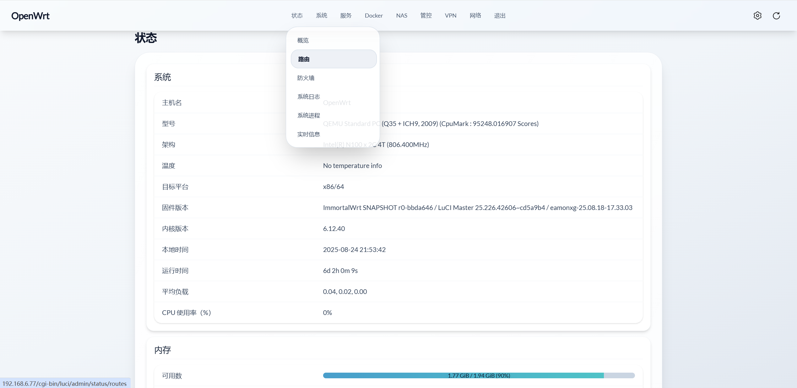
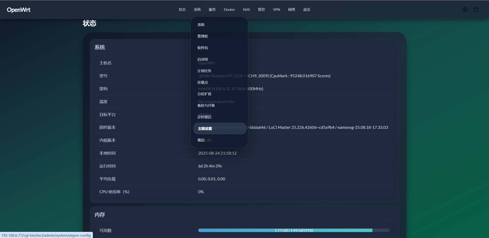
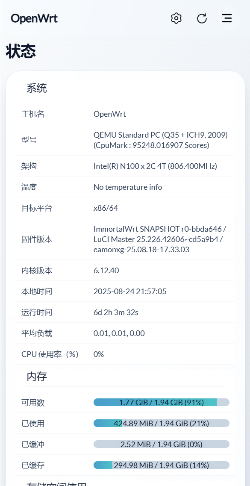

# LuCI Theme Aurora

[简体中文](README.md) | **English**

## Overview

**luci-theme-aurora** is an OpenWrt theme designed specifically for modern browsers.
The theme is inspired by **Aurora** — in Norway, the daytime reveals pure, pristine snow-capped mountains, while at night the sky comes alive with dancing auroras.
In this theme, the light mode reflects the purity of snow-capped peaks, and the dark mode showcases the enchanting beauty of the aurora.

## Compatibility

**OpenWrt**: Since the theme uses ucode templates, **OpenWrt 22.03** or later is required.

**Browsers**: Built with **TailwindCSS v4**, the theme works best on modern browsers:

**Chrome 111** (released March 2023)

**Safari 16.4** (released March 2023)

**Firefox 128** (released July 2024)

## Preview
Desktop Mode

 

Mobile Mode

## Development

Stepping into 2025, the frontend toolchain has become highly mature and advanced, yet the development approach for OpenWrt themes still feels outdated.
That is why fully embracing the modern frontend ecosystem is the core philosophy of the Aurora theme.
Aurora adopts **Vite** as its build tool.
During development, it leverages powerful preprocessors to let you freely choose and integrate any CSS toolchain;
in production, it optimizes bundled resources through techniques such as code minification and CSS tree-shaking;
and most importantly, with the help of a proxy server, CSS resource requests can be redirected to the development server, enabling **real-time preview of style changes**.